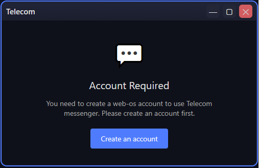
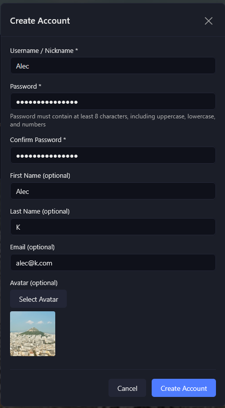
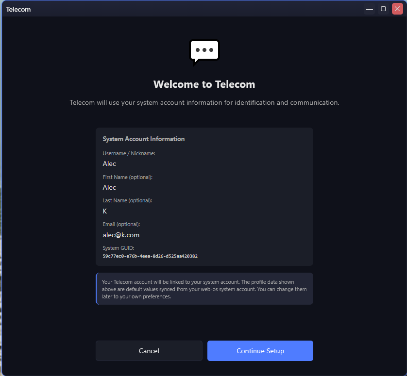
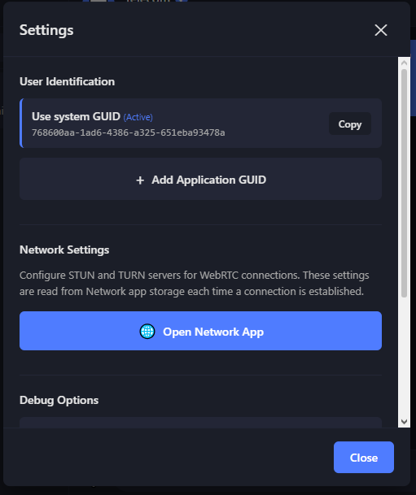
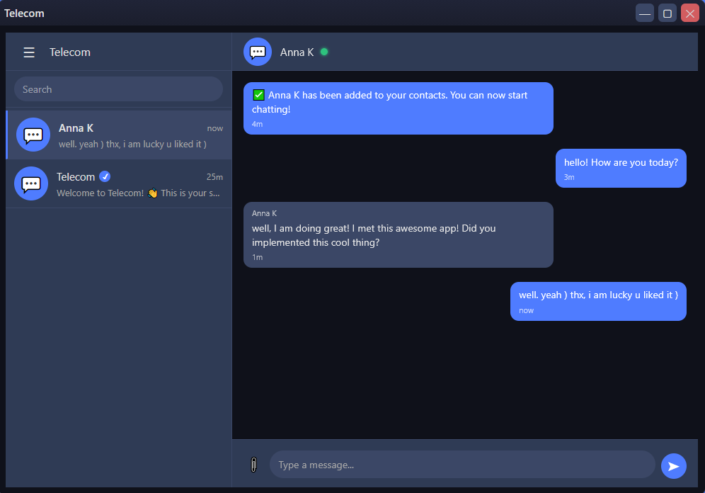
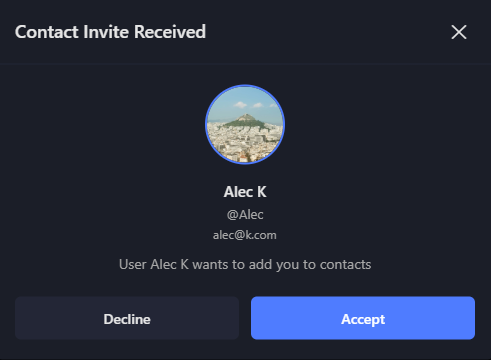
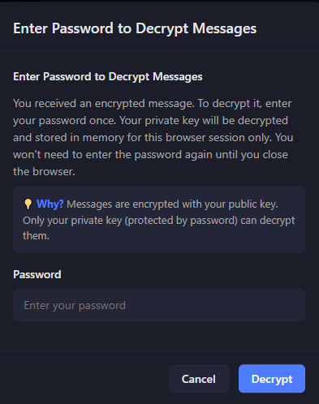

# Telecom Messenger (the only one secure in the world)

**The Only True Serverless Messenger** - Zero Message Servers, Direct Peer-to-Peer, End-to-End Encrypted

*Messages never touch a server. Ever.*

**Open Source & Dedicated to All People of the World** 🌍

Telecom is **100% open source** - free, transparent, and dedicated to all people of the world. The source code is available for anyone to review, audit, and contribute to. This project represents a commitment to privacy, freedom, and the right to secure communication for everyone, everywhere.

## Overview

Telecom is a decentralized messaging application that enables direct peer-to-peer communication between users without routing messages through centralized servers. Unlike traditional messengers that route messages through servers (Telegram, WhatsApp, Signal), Telecom enables **direct peer-to-peer communication** with **zero server infrastructure** for message delivery. Messages are encrypted end-to-end using RSA + AES encryption.

### Why Telecom Stands Out

**Decentralized Architecture:**
- **No message servers** - Messages travel directly from sender to recipient via WebRTC
- **No metadata collection** - No server logs, no tracking, no surveillance
- **No single point of failure** - No central servers to hack, compromise, or shut down
- **No government access** - No servers means no data to subpoena

**End-to-End Encryption:**
- **RSA-OAEP** for secure key exchange
- **AES-GCM** for message encryption
- **Private keys** encrypted and stored locally on your device only
- **Password-protected** private key decryption (one-time per browser session)

**Pure Peer-to-Peer:**
- Direct WebRTC connections between users
- Messages never touch intermediary servers
- Your data stays between you and your contact

## Features

- **Peer-to-Peer Communication**: Direct WebRTC connections between users
- **End-to-End Encryption**: RSA + AES encryption for message security
- **One-Tap Connection**: Easy connection establishment via one-tap links
- **Contact Management**: Add contacts via invites
- **Message Editing & Deletion**: Edit and delete sent messages
- **Offline Message Delivery**: Messages are queued and delivered when connection is restored

## Getting Started

### First Launch Wizard

When you first launch Telecom, a welcome wizard will guide you through the setup process:

1. **Welcome** 👋 - Introduction to Telecom
2. **Setup Your Profile** 👤 - Configure your display name and avatar
3. **Add a Contact** ➕ - Add contacts via invites
4. **Establish Connection** 🔗 - Set up WebRTC connection via one-tap links
5. **Encryption & Decryption** 🔐 - Learn about message encryption
6. **Send Your First Message** 💬 - Start chatting
7. **You're All Set!** 🎉 - Complete the setup

### Basic Workflow

1. **Setup Profile**: Go to Menu → Profile to customize your information
2. **Add Contact**: Go to Menu → Contacts → Add Contact, enter user GUID, send invite
3. **Accept Invite**: When you receive an invite, accept it to add the contact
4. **Establish Connection**: Click "Reconnect" button in chat header to generate one-tap link, paste it in chat
5. **Start Chatting**: Once connected (green circle), send messages!

## Connection Status

- 🟢 **Green Circle**: Connected and ready to send messages
- 🟡 **Yellow Circle**: Connecting...
- 🔴 **Red Circle**: Disconnected - use Reconnect button to restore connection

## Screenshots

### Setup & Configuration

#### Account Required Dialog

When launching Telecom without a web-os account, users are prompted to create one first:

This dialog appears when:
- User tries to open Telecom app
- No web-os account is detected
- User clicks "Create an account" button to proceed with account creation

#### Create Account Form

After clicking "Create an account", users see the account creation form:

The form includes:
- **Username / Nickname** (required) - Used for identification
- **Password** (required) - Must contain at least 8 characters, including uppercase, lowercase, and numbers
- **Confirm Password** (required) - Password confirmation
- **First Name** (optional) - User's first name
- **Last Name** (optional) - User's last name
- **Email** (optional) - User's email address
- **Avatar** (optional) - Profile picture selection

All fields except username and password are optional, allowing users to create accounts quickly.

#### Welcome Screen & System Account Sync

After creating an account, users see the Telecom welcome screen that syncs information from their web-os system account:

This screen shows:
- **Welcome message** explaining that Telecom will use system account information
- **System Account Information** section displaying:
  - Username / Nickname
  - First Name (optional)
  - Last Name (optional)
  - Email (optional)
  - System GUID (unique identifier)
- **Information box** explaining that:
  - Telecom account is linked to system account
  - Profile data is synced from web-os system account
  - Data can be changed later in preferences

Users can click "Continue Setup" to proceed or "Cancel" to exit.

#### Settings Dialog

Telecom settings can be accessed via Menu → Settings. The settings dialog includes:

**User Identification:**
- **Use system GUID** (Active) - Uses your web-os system account GUID
- Display of current GUID with "Copy" button
- Option to add Application GUID for separate Telecom identity

**Network Settings:**
- Configure STUN and TURN servers for WebRTC connections
- Settings are read from Network app storage each time a connection is established
- "Open Network App" button to configure ICE servers

**Debug Options:**
- Verbose logging toggle
- Other debugging features

### Main Interface

#### Main Chat Screen

The main Telecom interface consists of two panels:

**Left Sidebar (Contacts & Navigation):**
- **Hamburger menu** (☰) - Opens main menu
- **Search bar** - Search for contacts and chats
- **Contact list** showing:
  - Active chat (highlighted) - "Anna K" with last message preview and timestamp
  - System chat - "Telecom" with verification checkmark and welcome message preview
  - Last message preview and relative timestamps ("now", "25m")

**Right Panel (Chat Area):**
- **Chat header** with:
  - Contact name ("Anna K")
  - Status indicator (green circle = connected)
- **Message area** displaying:
  - **System messages** (left-aligned, blue) - Service notifications like "✔ Anna K has been added to your contacts"
  - **Sent messages** (right-aligned, blue) - User's own messages
  - **Received messages** (left-aligned, dark grey) - Messages from contact
  - Timestamps below each message ("4m", "3m", "1m", "now")
- **Message input area** with:
  - Attachment button (📎)
  - Text input field ("Type a message...")
  - Send button (➤)

**Features visible:**
- Dark theme with blue accent colors
- Emoji support (🍍)
- Real-time message timestamps
- Connection status indicator
- Message previews in contact list

### Connection Flow

#### Contact Invite Received Dialog

When a user receives a contact invite, they see a modal dialog:

The dialog displays:
- **Inviter's profile picture** - Avatar of the user sending the invite
- **Full name** - Display name of the inviter (e.g., "Alec K")
- **Username** - @username handle
- **Email** - Email address of the inviter
- **Invitation message** - "User [Name] wants to add you to contacts"
- **Action buttons**:
  - **Decline** - Reject the invite
  - **Accept** - Accept the invite and add the contact

After accepting, the contact is added to the user's contact list and a chat is created automatically.

### Encryption

#### Password Dialog for Message Decryption

When a user receives an encrypted message, they are prompted to enter their password to decrypt their private key:

The dialog explains:
- **Why password is needed**: Messages are encrypted with your public key. Only your private key (protected by password) can decrypt them.
- **One-time entry**: Password needs to be entered only once per browser session
- **Session storage**: Private key is decrypted and stored in memory for the current browser session only
- **No re-entry needed**: Password won't be required again until browser is closed

**Security features:**
- Private key is encrypted and stored locally
- Password is required to decrypt the private key
- Decrypted private key stays in memory only (not persisted)
- Messages are automatically decrypted after first password entry in the session

## Security & Privacy

### User Control & Identity Management

Telecom gives users complete control over their identity and contacts, providing powerful security features:

**GUID Management:**
- **System GUID** - Uses your web-os system account GUID (default)
- **Application GUID** - Generate a separate GUID for Telecom only
- **GUID Regeneration** - Change your Telecom identity at any time
- **Identity Separation** - Keep Telecom identity separate from system account

**Why This Matters:**
- **Identity Reset** - If your GUID is compromised, regenerate it to create a new identity
- **Privacy Control** - Use Application GUID to keep Telecom separate from your system account
- **Contact Isolation** - Changing GUID means old contacts can't reach you (unless you share new GUID)
- **Complete Control** - You decide when and how to change your identity

**Contact Management:**
- **Delete Contacts** - Remove contacts at any time
- **Break Connections** - Deleting a contact immediately closes WebRTC connection
- **No Persistence** - Deleted contacts cannot reconnect without new invite
- **Clean Slate** - Start fresh by removing unwanted contacts

**Security Benefits:**
- **Revocation** - If a contact is compromised, delete them immediately
- **Connection Termination** - Deleting a contact breaks all connections instantly
- **No Ghost Connections** - Deleted contacts cannot maintain stale connections
- **User Empowerment** - You control who can contact you

**Best Practices:**
1. Use Application GUID for maximum privacy separation
2. Regenerate GUID if you suspect compromise
3. Delete contacts you no longer trust
4. Share GUID only with trusted contacts
5. Regularly review your contact list

**Complete Data Deletion:**
- **Delete All Data** - Remove all chats, messages, contacts, and configuration
- **Browser Data** - Clear browser localStorage to remove all Telecom data
- **Account Deletion** - Delete web-os account to remove system GUID association
- **No Cloud Backup** - All data is local only, deletion is permanent
- **No Recovery** - Once deleted, data cannot be recovered (by design)

**Why This Matters:**
- **Complete Control** - You can permanently delete all your data at any time
- **No Server Copies** - Since there are no servers, deleting local data means complete deletion
- **Privacy Protection** - If device is compromised, you can delete everything instantly
- **Fresh Start** - Start completely fresh by clearing all data
- **Compliance** - Meets requirements for "right to be forgotten" - data can be completely removed

**How to Delete Everything:**
1. **Delete Telecom Data**: Settings → Dangerous Zone → Reset All Data
2. **Clear Browser Storage**: Clear browser's localStorage for the domain
3. **Delete Account**: Delete web-os account to remove system GUID
4. **Result**: All chats, messages, contacts, and identity completely removed

**Security Benefit:** Unlike cloud-based messengers where data may persist on servers even after account deletion, Telecom's serverless architecture means **deleting local data equals complete deletion**. There are no server backups, no cloud copies, no recovery mechanisms - when you delete, it's gone forever.

### Why Serverless Architecture Matters

Traditional messengers (Telegram, WhatsApp, Signal) route all messages through their servers. Even with end-to-end encryption, this creates vulnerabilities:

- **Metadata collection** - Servers know who you talk to, when, and how often
- **Server compromise** - Hackers can access server infrastructure
- **Government surveillance** - Servers can be monitored or shut down
- **Single point of failure** - One compromised server affects all users

**Telecom eliminates these risks** by removing servers from the message delivery path entirely.

### No WebSocket Server Required

**Technical Achievement:** Telecom was built without a WebSocket signaling server, despite initial recommendations to use one. This was a deliberate architectural decision that required solving complex challenges, but the result is a truly serverless messenger.

**Why This Matters:**
- **No Signaling Server** - Traditional WebRTC implementations require a signaling server (often WebSocket-based) to exchange connection metadata
- **Pure P2P Signaling** - Telecom uses localStorage for same-origin signaling and one-tap links for cross-origin
- **No Single Point of Failure** - Without a signaling server, there's nothing to shut down or compromise
- **Complete Independence** - No reliance on external infrastructure for signaling

**Challenges Overcome:**
- **Connection Establishment** - Solved using one-tap links (URL hash-based signaling)
- **Cross-Origin Communication** - Implemented manual link exchange instead of WebSocket server
- **State Synchronization** - Used localStorage for same-origin, external sharing for cross-origin
- **Reconnection** - Implemented reconnect via one-tap link generation

**Result:**
- ✅ **No WebSocket Server** - Zero server infrastructure for signaling
- ✅ **No Shutdown Risk** - Nobody can disable Telecom by shutting down servers
- ✅ **No Dependencies** - No external services required for basic operation
- ✅ **True Decentralization** - Complete independence from server infrastructure

**The Bottom Line:** While conventional wisdom suggested using a WebSocket signaling server, Telecom proves that **true serverless messaging is possible**. The challenges were real, but the solution is elegant: direct peer-to-peer connections with manual signaling exchange. **Nobody can shut Telecom down** because there are no servers to shut down.

### STUN/TURN Servers: Security Explained

**Important:** STUN and TURN servers are used for WebRTC connection establishment, but they serve fundamentally different purposes than message servers. Here's why they don't compromise security:

#### STUN Servers (Session Traversal Utilities for NAT)

**What they do:**
- Help discover your public IP address
- Assist in establishing direct peer-to-peer connections
- **Do NOT relay messages** - They only help find the connection path

**Security:**
- ✅ **No message content** - STUN servers never see your messages
- ✅ **No metadata** - They only see connection attempts, not who you're talking to
- ✅ **Public servers available** - Google's STUN servers are free and open
- ✅ **Optional** - If you're on the same network, STUN isn't even needed

**Think of STUN as a GPS** - It helps you find the route, but doesn't see what's inside your car.

#### TURN Servers (Traversal Using Relays around NAT)

**What they do:**
- Relay traffic when direct peer-to-peer connection is impossible (behind strict NAT/firewall)
- Act as a "bridge" for connections that can't be established directly

**Security concerns addressed:**

**1. "But TURN servers relay messages - doesn't that break security?"**
- ✅ **Messages are still encrypted** - TURN servers relay encrypted data only
- ✅ **They can't decrypt** - Without your private key, encrypted messages are useless
- ✅ **No message storage** - TURN servers forward data in real-time, no storage
- ✅ **You control the server** - Use your own TURN server for maximum security

**2. "Can TURN servers see who I'm talking to?"**
- ⚠️ **Metadata visibility** - TURN servers can see connection endpoints (IP addresses)
- ✅ **No message content** - They cannot see message content (encrypted)
- ✅ **No user identity** - They don't know your Telecom identity or contact names
- ✅ **Minimize exposure** - Use your own TURN server or trusted paid service

**3. "How is this different from Telegram/WhatsApp servers?"**
- **Telegram/WhatsApp**: Servers store metadata, user lists, contact relationships, message routing info
- **TURN servers**: Only relay encrypted data packets, no user accounts, no contact lists, no message history
- **Telecom**: Messages are encrypted before reaching TURN, TURN can't decrypt them

**Best practices for maximum security:**
1. **Use your own TURN server** - Full control, no third-party access
2. **Use paid TURN service** - Better privacy guarantees than free services
3. **Direct connection preferred** - TURN is only used when direct P2P fails
4. **Messages remain encrypted** - Even through TURN, encryption protects content

**Think of TURN as a postal service** - They deliver your sealed (encrypted) envelope, but can't read what's inside. Unlike traditional messengers, Telecom's "postal service" doesn't keep records of who sent what to whom.

### Encryption Details

#### Public/Private Key Pair System

Telecom uses **asymmetric cryptography** with RSA key pairs for secure communication:

**🔑 Key Pair Generation:**
- Each user generates a **unique RSA key pair** (public + private key)
- **Public key** - Shared with contacts, used to encrypt messages sent to you
- **Private key** - Stored encrypted on your device only, used to decrypt messages you receive
- **Key size**: RSA keys provide strong security for key exchange

**🔐 How Encryption Works:**

1. **Key Exchange:**
   - When you add a contact, you exchange **public keys** (not private keys!)
   - Public keys are shared via invites - safe to share publicly
   - Private keys **never leave your device**

2. **Sending Messages:**
   - Your message is encrypted with the **recipient's public key**
   - Only the recipient's **private key** can decrypt it
   - Even you cannot decrypt your own sent messages (only recipient can)

3. **Receiving Messages:**
   - Messages are encrypted with **your public key** (by the sender)
   - You decrypt them using **your private key**
   - Private key is password-protected and encrypted on disk

**🛡️ Security Layers:**

**Layer 1: RSA-OAEP (Asymmetric Encryption)**
- Used for **key exchange** and **message encryption**
- Public key encrypts, private key decrypts
- Mathematically impossible to derive private key from public key
- RSA-OAEP padding prevents certain attacks

**Layer 2: AES-GCM (Symmetric Encryption)**
- Used for **bulk message encryption** (faster than RSA)
- AES key is encrypted with RSA and sent with message
- GCM mode provides authentication (prevents tampering)

**Layer 3: Private Key Protection**
- Private key is **encrypted** before storage (not stored in plain text)
- **Password required** to decrypt private key (one-time per browser session)
- Decrypted private key stays **in memory only** (never written to disk)
- If device is compromised, attacker needs your password to decrypt private key

**🔒 Key Storage:**

- **Public keys**: Stored in contact information, safe to share
- **Private keys**: 
  - Encrypted with password-derived key
  - Stored in browser's localStorage (encrypted)
  - Never transmitted over network
  - Never shared with anyone

**Why This is Secure:**

1. **Forward Secrecy**: Each message uses unique encryption keys
2. **No Key Escrow**: Private keys never leave your device
3. **Password Protection**: Even if device is stolen, password is needed
4. **Memory-Only Decryption**: Decrypted keys never touch disk
5. **Mathematical Security**: RSA encryption is based on factoring large numbers (computationally infeasible)

**What Attackers Cannot Do:**

- ❌ **Decrypt messages** without private key (mathematically impossible)
- ❌ **Derive private key** from public key (RSA security)
- ❌ **Access private key** without password (encrypted storage)
- ❌ **Intercept messages** (encrypted end-to-end)
- ❌ **Modify messages** (AES-GCM authentication prevents tampering)
- ❌ **Read messages on server** (no servers in message path)

### Comparison with Other Messengers

| Feature | Telecom | Signal | Telegram | WhatsApp |
|---------|---------|--------|----------|----------|
| **Serverless** | ✅ Yes | ❌ No | ❌ No | ❌ No |
| **Message Servers** | ❌ None | ✅ Required | ✅ Required | ✅ Required |
| **Metadata Privacy** | ✅ Complete | ⚠️ Server knows contacts | ⚠️ Server knows contacts | ⚠️ Server knows contacts |
| **End-to-End Encryption** | ✅ Yes | ✅ Yes | ⚠️ Optional (Secret Chats) | ✅ Yes |
| **Government Access** | ✅ Impossible (no servers) | ⚠️ Possible (servers exist) | ⚠️ Possible (servers exist) | ⚠️ Possible (servers exist) |
| **Data Storage** | ✅ Local only | ⚠️ Server metadata | ⚠️ Server metadata | ⚠️ Server metadata |
| **Open Source** | ✅ Yes | ✅ Yes | ⚠️ Partial | ❌ No |

**Key Advantage:** Telecom is the only messenger where **messages never touch a message server**. Even Signal, considered the gold standard for privacy, routes messages through their servers (though encrypted). Telecom eliminates this entirely.

### Storage

- Contacts: `webos.telecom.contacts.v1`
- Chats: `webos.telecom.chats.v1`
- Messages: `webos.telecom.messages.{chatId}.v1`
- Configuration: `webos.telecom.v1`
- Invites: `webos.telecom.sent_invites.guid_from.{guid}` and `webos.telecom.received_invites.guid_to.{guid}`

## Known Issues & Limitations

- Connection may require TURN server for users behind NAT/firewall
- Messages are stored locally (no cloud sync)
- Connection breaks on page refresh (use Reconnect button)

## Future Improvements

- Group chats
- File sharing
- Voice/video calls
- Message search
- Cloud backup (optional)

## Open Source

**100% Open Source** - Telecom is completely open source, free for everyone to use, review, and contribute to.

**Dedicated to All People of the World:**
- This project is dedicated to all people of the world who value privacy and freedom
- No restrictions, no limitations, no hidden agendas
- Free for everyone, everywhere
- Built with transparency and trust

**Why Open Source Matters:**
- **Transparency** - Anyone can review the code and verify security claims
- **Auditability** - Security researchers can audit the implementation
- **Trust** - No hidden backdoors or surveillance code
- **Freedom** - Users can modify and customize for their needs
- **Community** - Anyone can contribute improvements

**Source Code:**
- Available in the repository
- Licensed for free use
- Contributions welcome

## Development Notes

- Main file: `js/apps/telecom.js`
- Translations: `js/i18n/en.js` (and other locale files)
- Uses custom test framework: `tests/telecom.browser.test.js`
